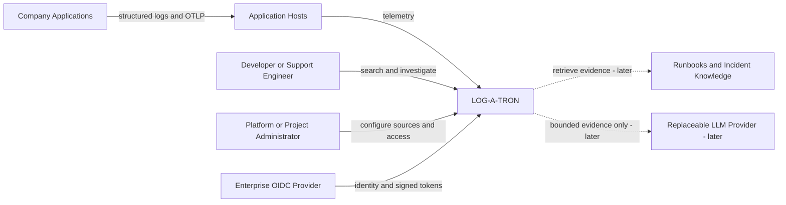
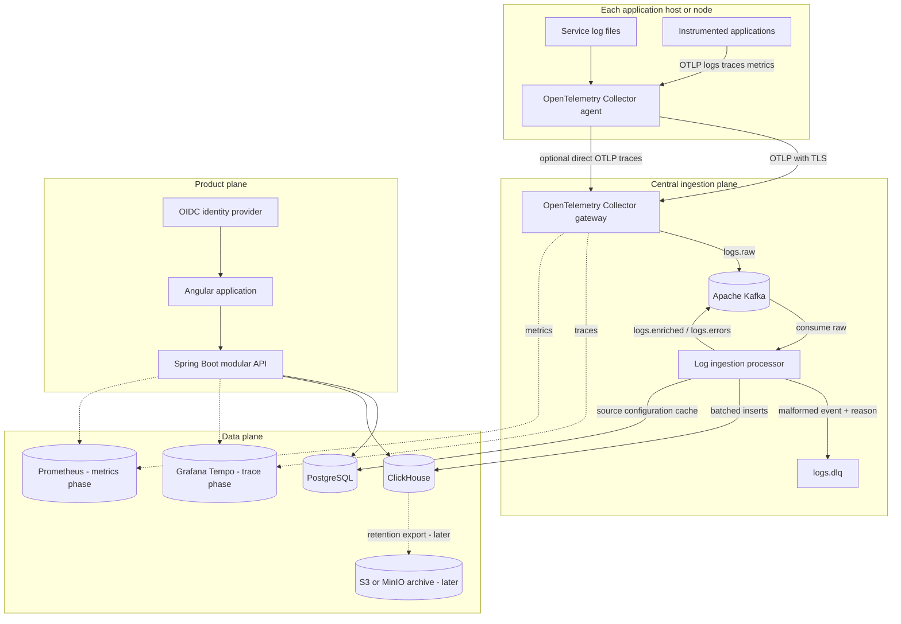
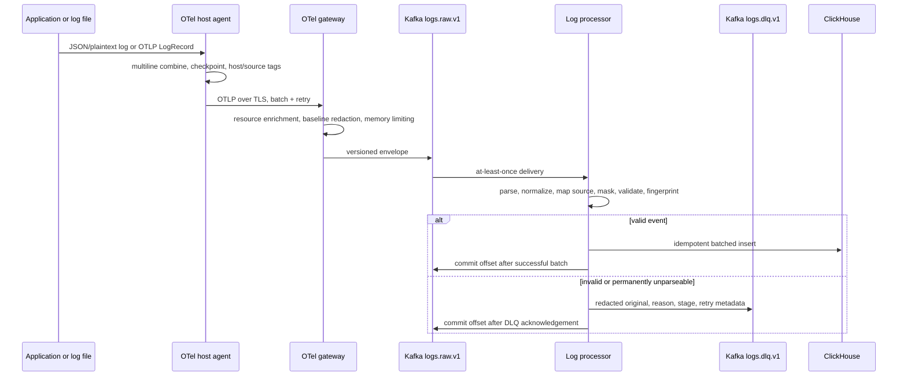
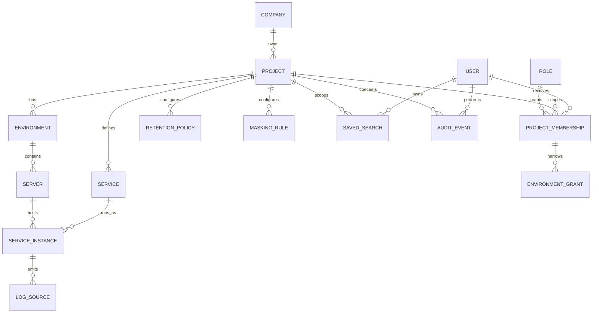
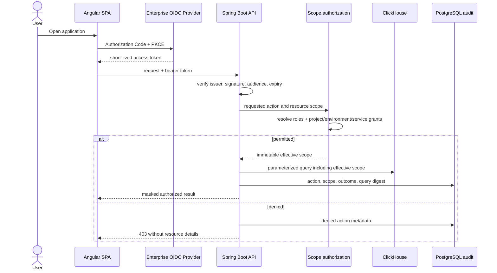
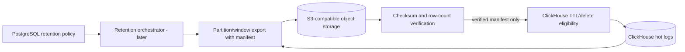
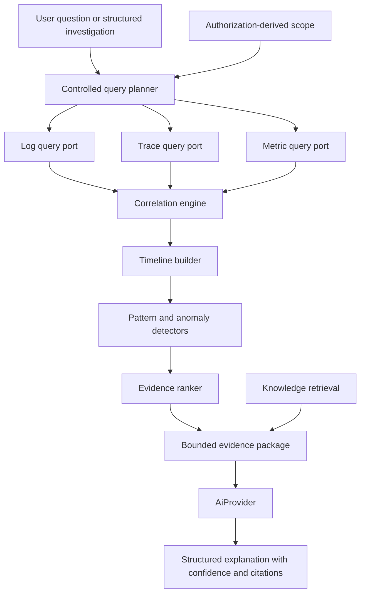

# LOG-A-TRON Architecture

## 1. Purpose and architectural stance

Implementation status: Phases 1–7 are complete through deterministic investigation, Prometheus correlation, and bounded structured AI RCA. RAG, alerts, incidents, and archival remain deferred.

LOG-A-TRON is an internal, multi-project observability platform for centrally searching logs from many hosts and services, correlating activity by trace and business identifiers, and reconstructing incident evidence. The first release established the trustworthy data and authorization foundation. The current milestone adds deterministic investigation and metrics as the source of truth, with AI limited to explaining a bounded evidence package and never placed on the critical path.

The V1 success criterion is:

> A permitted developer can select a project, environment, service, and time range; search logs collected from multiple servers; and follow a trace ID or correlation ID across those services without knowing physical log paths.

Key decisions:

- Use a Spring Boot modular monolith for the API and control plane. Module boundaries are enforced in code, but most modules deploy together.
- Use one separately deployable ingestion processor because it has different scaling, failure, and Kafka-consumer characteristics from the API.
- Use the OpenTelemetry Collector as the primary host collector and telemetry gateway. It covers logs, traces, and metrics with one standard pipeline and avoids an agent per service.
- Use Kafka as a durable ingestion buffer, never as permanent storage.
- Use ClickHouse for recent structured log analytics and PostgreSQL for configuration, identity metadata, audit records, and later pgvector knowledge data.
- Use Grafana Tempo for traces when trace storage is introduced. Tempo speaks OTLP, has low operational coupling, and integrates well with Grafana and trace-to-log links. It is optional in the initial log-search milestone.
- Enforce tenant and environment authorization in the backend before every query. Client-supplied project IDs are filters, not authorization.
- Keep the LLM behind deterministic investigation and a controlled query abstraction. It never receives database credentials or arbitrary SQL execution capability.

## 2. Scope boundaries

### V1 includes

- Project, environment, server, service, service-instance, and log-source metadata.
- OIDC/JWT resource-server security, role-based and resource-scoped authorization.
- Host-level OpenTelemetry Collector configuration for file logs and OTLP telemetry.
- Kafka raw, enriched, error, and dead-letter topics.
- Parsing, multiline handling, normalization, enrichment, masking, schema validation, and duplicate suppression.
- Batched ClickHouse storage and bounded log-search APIs.
- Angular project/service selectors and a log explorer.
- Trace/correlation/request/business-ID lookup across services.
- Saved searches, audited searches, and links from a log to related logs or a trace.
- Local Docker Compose infrastructure, seed metadata, and a sample log generator.

### Explicitly deferred

- LLM explanations, natural-language planning, RAG, and vector search.
- Automated RCA, anomaly detection, incident clustering, and evidence ranking.
- Long-term object-storage archival and configurable archive restore.
- Full metrics correlation, alert evaluation, and notification providers.
- Kubernetes manifests, multi-region operation, and active-active control planes.
- A custom trace visualization beyond a basic trace detail integration.

The interfaces and data model leave room for these capabilities; V1 does not operate unused infrastructure for them.

## 3. System context



## 4. Runtime container architecture



### Deployment units

| Unit | Responsibility | Scaling model |
|---|---|---|
| `platform-api` | REST/SSE APIs, authorization, metadata, search orchestration, audit | Horizontally; stateless |
| `log-processor` | Kafka consumption, parsing, masking, validation, deduplication, ClickHouse batches | Horizontally by Kafka partitions |
| `web-ui` | Angular static application | CDN/web server replicas |
| OTel agent | Host file tailing, checkpoints, local batching/retry, host metadata | One per host/node |
| OTel gateway | Central policy, redaction defense-in-depth, routing, retries | Horizontally; load-balanced |

The API and processor share versioned domain contracts but not database entity classes. They can be released together initially and separated further only when measured scaling requires it.

## 5. Repository structure

```text
LOG_A_TRON/
├── backend/
│   ├── pom.xml                         # Maven reactor
│   ├── common-contracts/               # canonical events, topic contracts, API primitives
│   ├── platform-api/                   # Spring Boot API/control-plane deployable
│   └── log-processor/                  # Kafka-to-ClickHouse deployable
├── frontend/                           # Angular workspace
│   └── src/app/
│       ├── core/
│       ├── shared/
│       └── features/
├── infrastructure/
│   ├── compose/
│   ├── clickhouse/migrations/
│   ├── otel/
│   ├── prometheus/
│   ├── tempo/
│   └── grafana/
├── tools/
│   └── log-generator/
├── docs/
├── docker-compose.yml
├── .env.example
├── ARCHITECTURE.md
└── IMPLEMENTATION_PLAN.md
```

Three Maven modules are sufficient. Creating a Maven module for every logical backend module would add build and dependency overhead without an operational benefit.

## 6. Backend logical modules

Logical modules live as top-level packages inside `platform-api` and expose explicit application services. Spring Modulith may be used to verify dependencies, but is not required for runtime behavior.

| Module | Owns | May depend on |
|---|---|---|
| `auth` | authenticated principal, permission evaluation, project/environment scopes | `common`, `audit` interface |
| `catalog` | companies, projects, environments, servers, services, instances, log sources | `common`, `auth` |
| `logquery` | controlled search abstraction, context queries, live stream, saved searches | `common`, `auth`, `audit`, catalog read ports |
| `tracequery` | trace lookup and log/trace linking | `common`, `auth`, catalog read ports |
| `investigation` | later deterministic timelines, correlation, evidence | `logquery` and trace/metric ports; never persistence adapters directly |
| `incident` | later incident lifecycle and evidence references | `auth`, investigation ports |
| `knowledge` | later runbooks, known errors, pgvector retrieval | `auth`, `audit` |
| `alerting` | later rule definitions and notification ports | query/metrics ports |
| `audit` | append-only sensitive-action records and export | `common` |
| `administration` | retention, masking, collector config, permissions | module application services, not repositories |
| `common` | errors, pagination, time abstractions, identifiers | no feature module |

Rules:

- Controllers call application services; they do not call repositories.
- PostgreSQL JPA entities remain private to their owning module.
- ClickHouse access is through purpose-specific query and insert ports, not JPA.
- DTOs are immutable Java records where practical.
- Every ClickHouse query requires an authorization-derived scope and bounded time range.
- The ingestion processor has `consume`, `parse`, `enrich`, `protect`, `validate`, and `store` packages with one-way dependencies.

## 7. Frontend architecture

Angular uses standalone components, strict TypeScript, lazy feature routes, signals for local UI state, and RxJS for streams. PrimeNG provides accessible enterprise controls; a small design-token layer prevents feature code from depending on theme details.

```text
src/app/
├── core/
│   ├── auth/                 # OIDC client, route guard, token interceptor
│   ├── api/                  # generated API client and error mapping
│   ├── layout/               # shell, navigation, breadcrumbs
│   └── telemetry/            # frontend tracing/error reporting
├── shared/
│   ├── components/           # time range, scope picker, empty/error states
│   ├── models/
│   └── utilities/
└── features/
    ├── overview/
    ├── projects/
    ├── logs/                 # search, live tail, context, detail/JSON views
    ├── traces/               # trace detail and related logs
    ├── investigations/       # introduced after deterministic engine
    ├── incidents/            # later
    ├── alerts/               # later
    ├── knowledge/            # later
    └── administration/
```

V1 routes are `overview`, `projects`, `logs`, `traces/:traceId`, and the required administration screens. Later navigation items should not be presented as functional until their backends exist.

## 8. Canonical log event

The wire contract is versioned (`schemaVersion`) and uses UTC instants. Missing optional values are absent or null; empty strings are not semantically meaningful.

```json
{
  "schemaVersion": 1,
  "eventId": "01J...",
  "timestamp": "2026-08-25T10:30:10.123Z",
  "observedTimestamp": "2026-08-25T10:30:10.456Z",
  "ingestedAt": "2026-08-25T10:30:11.012Z",
  "company": "ExampleCo",
  "companyId": "uuid",
  "project": "Demo Marketplace",
  "projectId": "uuid",
  "environment": "PROD",
  "environmentId": "uuid",
  "server": "prod-app-03",
  "serverId": "uuid",
  "hostname": "prod-app-03.internal",
  "serverIp": "192.0.2.15",
  "service": "settlement-service",
  "serviceId": "uuid",
  "serviceInstance": "settlement-service-7d9f",
  "serviceInstanceId": "uuid",
  "logFile": "/logs/settlement/application.log",
  "logType": "application",
  "level": "ERROR",
  "severityNumber": 17,
  "traceId": "32-hex-characters",
  "spanId": "16-hex-characters",
  "traceFlags": "01",
  "requestId": "req-123",
  "correlationId": "corr-123",
  "transactionId": "txn-123",
  "orderToken": "demo-order-42",
  "auctionId": "auction-22",
  "logger": "com.example.SettlementService",
  "thread": "kafka-consumer-2",
  "message": "Database operation timed out",
  "exceptionType": "java.sql.SQLTimeoutException",
  "stackTrace": "...",
  "body": {"originalFormat": "logback-json"},
  "attributes": {"kafka.topic": "settlements", "deployment.version": "2.3.1"},
  "resourceAttributes": {"host.id": "...", "cloud.region": "..."},
  "dataClassification": "INTERNAL",
  "maskingApplied": true,
  "fingerprint": "sha256-canonical-content",
  "collectorId": "otel-prod-app-03",
  "sourceOffset": "file-id:offset"
}
```

Design notes:

- UUID metadata IDs are authoritative for authorization and joins; names are denormalized for readable ClickHouse queries.
- `eventId` is generated at the earliest reliable collection stage and retained across Kafka retries.
- `attributes` and `resourceAttributes` allow controlled evolution. Frequently filtered fields graduate to typed columns through migrations.
- Raw unmasked payloads are not retained. A parsing failure is redacted before it enters the DLQ.
- `fingerprint` supports idempotency but is not a perfect global identity. Duplicate suppression uses `eventId` first and the fingerprint/source offset within a configurable window second.
- Stack traces have an ingestion and API size cap. Oversized values are truncated with explicit attributes describing the original size.

## 9. Ingestion and OpenTelemetry flow



### Collector choice

OpenTelemetry Collector is the primary collector because one host agent can tail multiple service files while also accepting OTLP logs, traces, and metrics. Its filelog receiver uses persisted offsets and supports rotation and multiline operators. A central gateway creates one place for routing, resource policy, backpressure, batching, and defense-in-depth masking. Fluent Bit or Vector remains an adapter option for sources the OTel filelog receiver cannot handle; introducing either is not a V1 default.

Agent configuration is generated from approved `log_source` records. Path ownership mapping occurs both at the agent (stable source attributes) and processor (authoritative metadata lookup). Unknown sources are quarantined instead of guessed.

### Trace context

- HTTP uses W3C `traceparent` and `tracestate`; `baggage` is allowlisted and must not carry secrets or unrestricted PII.
- Java services use the OTel Java agent initially, with SDK instrumentation only for custom spans/attributes.
- Kafka producers inject W3C context into headers; consumers extract it and create a consumer/process span. Business correlation identifiers are explicit allowlisted headers.
- JDBC instrumentation creates client spans where supported. SQL statement capture is disabled or sanitized by default.
- Logback emits trace/span IDs through MDC/OTel log correlation.
- Resource attributes include `service.name`, `service.instance.id`, `deployment.environment.name`, `host.id`, and the platform project ID.

## 10. Kafka topic design

Topics are versioned so incompatible contract changes can coexist during migration.

| Topic | Key | Purpose | Initial retention |
|---|---|---|---|
| `logs.raw.v1` | `null` in the Phase 2 OTel pipeline (accepted deviation; target is `projectId:serviceId`) | durable raw-but-baseline-redacted ingestion buffer | 24-72 hours |
| `logs.enriched.v1` | `projectId:serviceId` | optional fan-out contract for future consumers; V1 storage consumer may emit it transactionally | 24-72 hours |
| `logs.errors.v1` | `projectId:serviceId` | normalized WARN/ERROR stream for later alerting | configurable short retention |
| `logs.dlq.v1` | `projectId` or `unknown` | redacted failed event, failure stage/reason, replay metadata | 7-14 days |
| `incident.events.v1` | `incidentId` | later incident state/evidence changes | later phase |

Phase 2 raw-key deviation: the deployed OpenTelemetry Collector Kafka exporter v0.135.0 cannot derive the literal `projectId:serviceId` key from the raw envelope. Its supported log option hashes the complete OTel resource-attribute set instead of selecting and concatenating these two envelope fields. Raw records therefore retain a null key and the exporter/Kafka partitioner distributes them without project/service affinity. The operational consequence is that the raw topic does not preserve per-project/service partition ordering; the envelope still carries the authoritative IDs, and the processor's enriched/error/DLQ output keying is unchanged. Revisit the target only when the deployed exporter supports a direct, reliable key expression or upstream request metadata supplies the key; no custom adapter is introduced for Phase 2.

Partitioning the keyed canonical topics by project and service preserves useful local ordering and spreads high-volume services. There is no promise of total ordering across partitions; timestamps and observed time drive timeline reconstruction. Partition count is capacity-planned and increased carefully because key-to-partition assignment changes when counts change.

Delivery is at least once. The processor commits Kafka offsets only after ClickHouse acknowledges its batch or the event is durably written to the DLQ. Producer idempotence is enabled. Exactly-once marketing claims are avoided: end-to-end duplicates are handled with stable IDs and query/storage deduplication.

## 11. ClickHouse schema

Schemas are maintained as versioned SQL migrations. The initial cluster may be single-node for local development; production uses replicated tables and a distributed table only when required.

```sql
CREATE TABLE logs_local
(
    schema_version UInt16,
    event_id String,
    timestamp DateTime64(3, 'UTC') CODEC(Delta, ZSTD),
    observed_timestamp DateTime64(3, 'UTC') CODEC(Delta, ZSTD),
    ingested_at DateTime64(3, 'UTC') CODEC(Delta, ZSTD),

    company_id UUID,
    project_id UUID,
    environment_id UUID,
    server_id Nullable(UUID),
    service_id UUID,
    service_instance_id Nullable(UUID),

    company LowCardinality(String),
    project LowCardinality(String),
    environment LowCardinality(String),
    server LowCardinality(String),
    hostname LowCardinality(String),
    server_ip String,
    service LowCardinality(String),
    service_instance String,
    log_file String,
    log_type LowCardinality(String),
    level Enum8('TRACE'=1, 'DEBUG'=2, 'INFO'=3, 'WARN'=4, 'ERROR'=5, 'FATAL'=6, 'UNKNOWN'=0),
    severity_number UInt8,

    trace_id FixedString(32),
    span_id FixedString(16),
    request_id String,
    correlation_id String,
    transaction_id String,
    order_token String,
    auction_id String,

    logger LowCardinality(String),
    thread String,
    message String CODEC(ZSTD),
    exception_type LowCardinality(String),
    stack_trace String CODEC(ZSTD),
    attributes Map(LowCardinality(String), String),
    resource_attributes Map(LowCardinality(String), String),
    data_classification LowCardinality(String),
    masking_applied Bool,
    fingerprint FixedString(64),
    collector_id LowCardinality(String),
    source_offset String,

    INDEX idx_trace trace_id TYPE bloom_filter(0.001) GRANULARITY 4,
    INDEX idx_correlation correlation_id TYPE bloom_filter(0.005) GRANULARITY 4,
    INDEX idx_request request_id TYPE bloom_filter(0.005) GRANULARITY 4,
    INDEX idx_order order_token TYPE bloom_filter(0.005) GRANULARITY 4,
    INDEX idx_exception exception_type TYPE set(1000) GRANULARITY 4,
    INDEX idx_message_tokens message TYPE tokenbf_v1(32768, 3, 0) GRANULARITY 8
)
ENGINE = ReplacingMergeTree(ingested_at)
PARTITION BY toYYYYMM(timestamp)
ORDER BY (project_id, environment_id, service_id, toDate(timestamp), level, timestamp, event_id)
TTL timestamp + INTERVAL 90 DAY DELETE
SETTINGS index_granularity = 8192;
```

This is a baseline, not a universal production DDL:

- Monthly partitions avoid an excessive partition count while enabling coarse retention pruning. Daily partitions are justified only after measured volume and deletion behavior demand them.
- The sort key optimizes the V1 scope/time/service filters. Bloom indexes accelerate sparse identifier lookup after project/time scope is applied.
- `ReplacingMergeTree` makes retries converge eventually; queries needing immediate uniqueness use `argMax`/grouping rather than routine `FINAL`, which is expensive.
- Global identifier searches still require an authorized project scope and a bounded range. A later identifier lookup table or projection is added only if measurements show the bloom path is insufficient.
- TTL is the platform-wide safety ceiling in V1. Policy-specific retention is implemented through a retention class column/table strategy in a later archive phase; mutating arbitrary row-level TTLs is avoided.
- Free-text search is token-based and bounded. ClickHouse is not presented as a full Lucene-compatible search engine.

Materialized aggregate for overview/error trends:

```sql
CREATE TABLE log_counts_1m
(
    bucket DateTime('UTC'),
    project_id UUID,
    environment_id UUID,
    service_id UUID,
    level UInt8,
    count AggregateFunction(count)
)
ENGINE = AggregatingMergeTree
PARTITION BY toYYYYMM(bucket)
ORDER BY (project_id, environment_id, service_id, level, bucket);

CREATE MATERIALIZED VIEW log_counts_1m_mv TO log_counts_1m AS
SELECT
    toStartOfMinute(timestamp) AS bucket,
    project_id, environment_id, service_id,
    toUInt8(level) AS level,
    countState() AS count
FROM logs_local
GROUP BY bucket, project_id, environment_id, service_id, level;
```

## 12. PostgreSQL metadata model

All mutable tables use UUID primary keys, optimistic versioning where applicable, UTC timestamps, and actor metadata. Names have tenant-scoped unique constraints. Flyway owns schema changes.



Core entities:

| Entity | Important fields and constraints |
|---|---|
| `company` | `id`, unique `slug`, `name`, `status` |
| `project` | `company_id`, unique `(company_id, slug)`, name, classification, status |
| `environment` | `project_id`, unique `(project_id, code)`, type (`DEV/UAT/PROD/...`), sensitivity, status |
| `server` | `environment_id`, stable `host_id`, hostname, IP, labels JSONB, collector status/heartbeat |
| `service` | `project_id`, unique service key, display name, owner, criticality, labels JSONB |
| `service_instance` | `service_id`, `server_id`, instance key, version, lifecycle status, first/last seen |
| `log_source` | instance/server scope, path pattern, format/parser profile, log type, multiline rule, enabled, config version |
| `user_account` | OIDC subject and issuer, display metadata, status; no local password in normal enterprise mode |
| `role` | stable role code; permissions map to application actions |
| `project_membership` | user, project, role, validity, unique active grant |
| `environment_grant` | membership, environment, optional service scope; absence follows role policy, not implicit allow |
| `retention_policy` | project/environment/log-type/severity selector, hot days, archive days, priority, effective dates |
| `masking_rule` | scope, detector type, encrypted/controlled replacement config, priority, version, status |
| `saved_search` | owner, project scope, name, validated query DTO JSONB, visibility, version |
| `audit_event` | append-only actor, action, resource/scope, outcome, query digest, client/trace metadata, timestamp |

Later-phase tables include `incident`, `incident_evidence`, `investigation`, `investigation_evidence`, `alert_rule`, `known_error`, `runbook`, `knowledge_document` (with pgvector), and `notification_delivery`. Log bodies and stack traces are never copied into PostgreSQL audit rows.

## 13. Query architecture and APIs

The API accepts structured filters and compiles only known operations into parameterized ClickHouse SQL. It never accepts SQL fragments, column names, or arbitrary expressions from clients or an LLM.

### Query constraints

- Authorization scope is calculated from the authenticated principal and intersected with requested project/environment/service filters.
- Requests without a permitted project scope fail closed.
- Default range: 30 minutes; V1 maximum interactive range: 24 hours, configurable by role and environment.
- Cursor pagination uses `(timestamp, eventId)`; offset pagination is not used for deep log pages.
- Default page size 100, maximum 500. Stack traces are omitted from list rows and loaded in detail/context calls.
- Query timeout, result byte cap, concurrency limits, and per-user rate limits are enforced.
- Free text length and syntax are validated; leading unrestricted regex is not supported.
- All sensitive searches, exports, and administration changes produce audit events.

### V1 REST API

| Method and path | Purpose |
|---|---|
| `GET /api/v1/me` | effective identity, roles, and visible scopes |
| `GET /api/v1/projects` | authorized projects only |
| `GET /api/v1/projects/{id}/environments` | authorized environments |
| `GET /api/v1/environments/{id}/servers` | scoped server inventory |
| `GET /api/v1/projects/{id}/services` | scoped service inventory |
| `POST /api/v1/logs/search` | validated, cursor-paged log search |
| `GET /api/v1/logs/{eventId}` | detail if event is within authorized scope |
| `POST /api/v1/logs/context` | surrounding logs within bounded window |
| `POST /api/v1/logs/correlate` | related events by one approved identifier |
| `GET /api/v1/logs/live` | SSE stream with scoped validated filters and connection limits |
| `GET/POST/PUT/DELETE /api/v1/saved-searches` | user/team saved searches |
| `GET /api/v1/traces/{traceId}` | trace summary plus authorized related logs |
| `GET /api/v1/overview` | pre-aggregated scoped rates/counts |
| `GET/POST/PUT /api/v1/admin/...` | metadata, sources, policies, and grants with admin permissions |

Every error follows a stable format:

```json
{
  "timestamp": "2026-08-25T10:32:00Z",
  "status": 400,
  "errorCode": "INVALID_TIME_RANGE",
  "message": "The requested range exceeds 24 hours.",
  "traceId": "9f...",
  "fieldErrors": [{"field": "to", "code": "RANGE_TOO_LARGE"}]
}
```

No internal stack trace, SQL, connection detail, or masked input is returned.

### Controlled investigation abstraction (later)

`InvestigationQuery` is a sealed set of operations such as `FindByTrace`, `FindByBusinessId`, `ErrorTrend`, `FirstFailure`, and `CompareWindows`. The natural-language planner may populate these validated DTOs; it cannot add a new operation or bypass authorization, time, and row limits.

## 14. Security and multi-tenancy

### Authentication and authorization flow



### Roles and permissions

Roles are permission bundles, not controller conditionals:

- `ADMIN`: platform configuration and all scopes.
- `PROJECT_ADMIN`: catalog, memberships, sources, and policies for assigned projects.
- `PRODUCTION_SUPPORT`: approved PROD search/investigate permissions for assigned scopes.
- `DEVELOPER`: DEV/UAT by default; PROD only through an explicit grant.
- `VIEWER`: read-only dashboards/search in granted scopes, with export disabled by default.
- `AUDITOR`: audit metadata and approved evidence access; cannot mutate configuration.

Environment and optional service grants narrow roles. Deny-by-default applies when scope resolution is ambiguous. PostgreSQL row-level security may be defense-in-depth for metadata, but application authorization remains mandatory and ClickHouse queries always include effective scope predicates.

### Data protection

- TLS for browser/API, OTLP, Kafka, and database connections outside local development; mTLS for collectors where feasible.
- Secrets supplied through a secret manager in production and environment/file secrets locally; never committed in Compose files.
- Masking at the gateway and authoritative masking in the processor. Rules cover authorization headers, JWTs, credentials, tokens, API keys, account identifiers, and configured PII.
- Raw unmasked logs are not put on Kafka. Access to DLQ replay is a separate permission and replay is audited.
- Log response DTOs apply a final masking policy to protect against historical rule gaps.
- Audit records store query criteria digests and resource references, not sensitive log bodies.
- Export is a distinct permission with row/size limits, watermarks/metadata where appropriate, and audit.
- CSP, secure headers, PKCE, no browser token persistence beyond the chosen OIDC library's secure strategy, and dependency/container scanning are required.

## 15. Retention and archive flow

V1 has a configurable hot-retention ceiling and records granular policies, but policy-based object archival is implemented later after the query path is stable.



Archives use compressed Parquet partitioned by company/project/environment/date and protected by bucket policies, encryption, lifecycle rules, and immutable manifests. Deletion is never authorized merely because an export command returned successfully; verification and policy/legal-hold checks are required.

## 16. Deterministic investigation and AI evolution

The current repository implements this boundary with a deterministic template stub. No external LLM is configured or called; provider-backed model integration remains a future extension.



Evidence records carry source type, stable reference, observed time, scope, relevance score, and fact status. The AI result separates `CONFIRMED_FACT`, `STRONG_EVIDENCE`, `PROBABLE_INFERENCE`, and `POSSIBLE_HYPOTHESIS`. Every material conclusion references evidence IDs. Provider output is schema-validated; a failed or unverifiable explanation does not replace deterministic results.

```java
public interface AiProvider {
    InvestigationExplanation explain(InvestigationEvidencePackage evidence);
}
```

## 17. Local Docker infrastructure

The initial Compose profile contains only components used by the current milestone:

- Kafka in KRaft mode (no ZooKeeper).
- PostgreSQL.
- ClickHouse server.
- OpenTelemetry Collector gateway.
- `platform-api`, `log-processor`, `web-ui`, and `log-generator`.

Optional profiles add MinIO, Tempo, Prometheus, Grafana, and an OIDC development provider when their phases begin. This honors the requirement to avoid running unused components while preserving one documented path to the target architecture.

Compose requirements:

- Named persistent volumes for PostgreSQL, ClickHouse, Kafka, Tempo, and MinIO.
- Health checks based on real readiness endpoints/queries, not process existence.
- `depends_on` health conditions only for startup convenience; applications still retry dependencies with bounded exponential backoff.
- Explicit resource limits for developer machines and configurable ports through `.env`.
- Separate internal networks for data services and ingress where Compose supports the intended topology.
- Seed data and topics initialized by idempotent one-shot jobs.
- No default production passwords; `.env.example` contains placeholders and documents generation.

## 18. Platform observability

The platform instruments itself with OpenTelemetry from the first executable phase. Minimum telemetry includes:

- received, parsed, rejected, masked, deduplicated, and stored events;
- per-topic consumer lag and batch insert duration/failures;
- DLQ rate by failure reason, never raw sensitive content in metric labels;
- ClickHouse query latency, rows/bytes scanned, timeout and rejection counts;
- API request duration/error counts and authorization denials;
- collector last-seen and dropped/retried record counts;
- JVM, Kafka client, connection pool, and process telemetry;
- trace propagation across API, Kafka processor, PostgreSQL, and ClickHouse calls.

Metric labels use bounded IDs/categories; trace IDs, user IDs, exception messages, and business identifiers are not metric labels.

## 19. Availability and failure behavior

- Host agents persist file offsets and buffer to disk within a configured bound. Rotation uses file identity rather than path alone.
- The gateway batches and retries. When limits are exhausted, it emits explicit drop metrics and alerts rather than silently losing data.
- Kafka absorbs ClickHouse outages. Processor consumption slows/stops before memory becomes unbounded.
- Poison events have bounded retries and then go to a redacted DLQ; one event cannot block a partition forever.
- ClickHouse inserts use bounded batches and stable event IDs. Partial/uncertain failures are safe to retry.
- Search APIs return an explicit dependency-unavailable or timeout error and a platform trace ID; they never silently return incomplete results as complete.
- Live tail is best-effort and is not a substitute for persisted search.
- Configuration changes are versioned. Collectors report the applied version so drift is visible.

## 20. Performance model

Initial target: millions of events per day with a path to hundreds of millions. Exact SLOs must be set after representative load tests; proposed starting objectives are p95 search under 2 seconds for a 30-minute scoped query, 99.9% monthly API availability excluding planned maintenance, and no acknowledged-event loss under a single-component restart.

Capacity levers include Kafka partitions, processor replicas, batch size, ClickHouse shards/replicas, storage tier, cardinality controls, and per-tenant quotas. Changes are driven by observed rows/bytes scanned, compression ratio, merge pressure, ingestion latency, and consumer lag.

## 21. Architecture risks and mitigations

| Risk | Consequence | Mitigation |
|---|---|---|
| Inconsistent legacy log formats | parsing failures and weak correlation | parser profiles, JSON logging standard, redacted DLQ, coverage metrics |
| Missing trace/business IDs | incomplete timelines | OTel agent rollout, MDC standards, Kafka header propagation, correlation quality score |
| Cross-tenant data exposure | severe security incident | authorization-derived scopes, deny-by-default query API, security tests, audited access |
| High-cardinality/unbounded queries | ClickHouse overload | mandatory scope/time bounds, cursor paging, quotas, timeouts, aggregate tables |
| Duplicate/out-of-order delivery | misleading timelines/counts | stable event IDs, idempotent retry, observed timestamps, explicit ordering confidence |
| Sensitive data before masking | exposure in pipeline | app guidance plus gateway pre-mask, processor authoritative mask, no unmasked raw topic |
| ClickHouse unavailable | growing lag and delayed search | Kafka buffering, backpressure, disk capacity alerts, replayable batches |
| Collector offset loss/rotation errors | gaps or duplicates | persistent storage, file identity, rotation integration tests, heartbeat/checkpoint metrics |
| Schema evolution | broken consumers | versioned topics/contracts, tolerant readers, compatibility tests, dual-read migration |
| Too many early components | operational drag | Compose profiles and phased activation; modular monolith by default |
| AI overstatement | unsafe conclusions | evidence package, confidence taxonomy, citations, schema validation, human review |
| Retention-policy conflicts | premature deletion or cost growth | precedence rules, legal holds, verified archive manifests, deletion audit |

## 22. Assumptions and open decisions

Assumptions for planning:

- The company has or will choose an OIDC provider; the platform will not become a password authority.
- Hosts can reach a central OTLP endpoint and run one collector process or sidecar/DaemonSet equivalent.
- Application teams can progressively adopt structured JSON logging and W3C trace context.
- Server and service metadata have stable identifiers even if hostnames or instances change.
- V1 starts in one region and one security boundary; disaster recovery requirements will be specified before production launch.
- ClickHouse hot retention is acceptable for recent search; archive retrieval latency is not a V1 requirement.
- Kafka and ClickHouse production topology, volumes, SLOs, and retention sizes will be based on measured event rates and average record sizes.

Decisions needed before production implementation:

- Enterprise IdP, group-to-role mapping, and emergency access process.
- Expected peak events/second, average/p99 event size, retention, and recovery objectives.
- Exact PII classifications, masking semantics, legal holds, and export approvals.
- Network zones, certificate authority, secret manager, and production Kafka/ClickHouse ownership.
- Whether service/project metadata is manually managed or synchronized from a CMDB/service catalog.
- Whether Tempo is operated by this team or consumed as an existing enterprise service.

## 23. Complexity review

The target vision names many valid technologies, but deploying all of them in V1 would increase failure modes before the core product proves value. The following simplifications are intentional:

- A modular monolith replaces a fleet of control-plane microservices.
- Only ingestion is a separate worker because its scaling boundary is already real.
- OTel Collector is the sole default host agent; Fluent Bit and Vector are compatibility options, not coequal stacks.
- Tempo, Prometheus/Grafana, MinIO, pgvector, alert providers, and LLM infrastructure are activated in later phases.
- PostgreSQL stores metadata; ClickHouse stores logs. There is no additional search engine or vector database in V1.
- One canonical log table and one minute aggregate are enough initially. Projections, identifier lookup tables, distributed tables, and policy-class tables require query evidence.
- No arbitrary SQL, general-purpose query language, workflow engine, or event-sourcing framework is introduced.

This leaves a production-oriented but operable first system whose hardest guarantees—collection durability, canonicalization, tenant isolation, bounded search, and correlation—can be tested directly.
