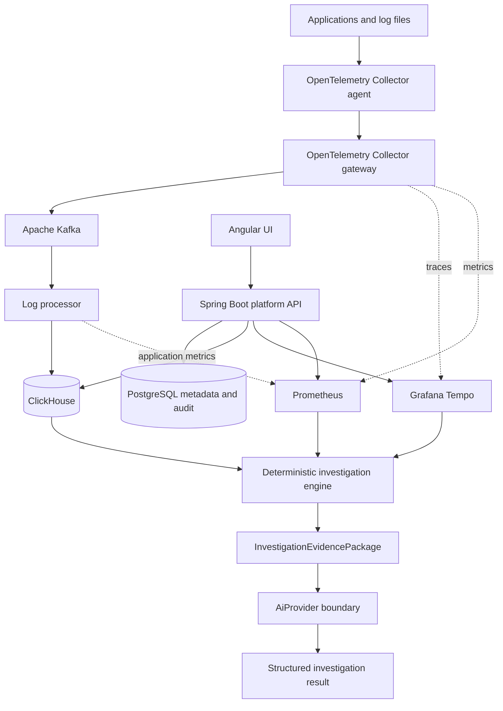

# LOG-A-TRON

> Evidence-driven observability and root-cause investigation across logs, traces, and metrics.

[](LICENSE)

LOG-A-TRON is an open-source observability platform that centralizes telemetry and reconstructs deterministic, evidence-backed investigations across distributed systems. The v0.7.0 foundation combines durable log ingestion, authorization-scoped search, distributed tracing, metrics correlation, and a bounded root-cause analysis workflow in one local Docker Compose stack.

## Overview

LOG-A-TRON ingests application logs through OpenTelemetry, moves them durably through Kafka, canonicalizes and masks them, and stores structured events in ClickHouse. A Spring Boot control plane applies server-derived authorization before querying logs, Grafana Tempo traces, or Prometheus metrics. The investigation engine then orders evidence, identifies the earliest supported failure, and separates initiating failures from downstream symptoms.

The repository is a development and evaluation foundation for Phases 1–7. It does not claim production readiness, hosted service availability, or external AI integration.

## Why LOG-A-TRON

- Logs, traces, and metrics are often fragmented across different tools and retention boundaries.
- The first visible error is frequently a retry, duplicate, lag spike, or other downstream symptom rather than the initiating failure.
- Engineers lose time manually aligning identifiers, timestamps, dependencies, and metric windows.
- Investigation must preserve project and environment authorization at every query boundary—not merely hide unauthorized results in the UI.

LOG-A-TRON brings those signals into a bounded investigation model with explicit provenance, confidence, and security controls.

## Key Features

### Ingestion and storage

- Multi-project and multi-environment log ingestion.
- OpenTelemetry Collector agent and gateway with file checkpoints, batching, redaction, and persistent queues.
- Kafka-backed at-least-once delivery with explicit retry and dead-letter behavior.
- Metadata enrichment, parsing, canonicalization, sensitive-data masking, validation, and stable fingerprinting.
- Structured ClickHouse persistence with bounded batches and eventual duplicate collapse.

### Search and correlation

- Authorization-scoped log search with structured filters and bounded query windows.
- Log detail, surrounding context, identifier correlation, and saved searches.
- Bounded Server-Sent Events live tail.
- Grafana Tempo distributed-trace lookup, trace waterfall, and log-to-trace navigation.
- Prometheus metric correlation through an allowlisted, scope-aware query boundary.

### Investigation experience

- Deterministic timeline reconstruction across logs, traces, and metrics.
- Earliest-supported-failure detection and downstream-symptom classification.
- Evidence references, confidence states, uncertainty warnings, dependency flow, and exception grouping.
- Bounded `InvestigationEvidencePackage` and replaceable `AiProvider` boundary.
- Angular Log Explorer, trace detail/waterfall, and Investigation UI.
- Audit events, non-enumerating authorization failures, and prompt-injection text treated as untrusted evidence data.

## Example Investigation

The sanitized demo scenario produces this causal sequence:

```text
DB pool reaches 50/50
        ↓
Settlement database timeout
        ↓
Kafka retry
        ↓
Duplicate delivery rejected
        ↓
Kafka lag increases
```

LOG-A-TRON identifies database-pool saturation as the initiating failure. The later settlement timeout, retry, duplicate rejection, and Kafka lag are retained as evidence but classified as downstream symptoms rather than competing root causes.

## Architecture



RAG, knowledge retrieval, incident workflows, alerting, and a real external AI provider are not part of the v0.7.0 implementation.

For deeper design detail, see [ARCHITECTURE.md](ARCHITECTURE.md), [DEVELOPMENT.md](DEVELOPMENT.md), [the ingestion runbook](docs/INGESTION.md), and [the investigation contract](docs/INVESTIGATIONS.md).

## Tech Stack

| Area | Technology |
|---|---|
| Backend | Java, Spring Boot |
| Frontend | Angular |
| Streaming | Apache Kafka |
| Telemetry | OpenTelemetry |
| Log analytics | ClickHouse |
| Distributed tracing | Grafana Tempo |
| Metrics | Prometheus |
| Metadata and control plane | PostgreSQL |
| Local runtime | Docker Compose |

## Security Model

- Effective authorization scope is derived server-side from project membership, roles, and environment grants.
- Client-supplied project, environment, service, and server IDs are filters—not authorization evidence.
- Project and environment isolation is enforced before log, trace, or metric queries execute.
- Gateway masking provides baseline protection; processor masking is authoritative before persistence and fan-out.
- Search accepts structured filters and compiles parameterized ClickHouse queries; arbitrary SQL is never accepted.
- Query time windows, result bytes, concurrency, live-tail duration, and evidence packages are bounded.
- Unauthorized resource lookups return non-enumerating responses.
- Administrative and investigation actions produce audit metadata.
- The AI boundary cannot broaden authorization scope or execute SQL/PromQL.
- Prompt-injection-like text inside logs is treated only as untrusted evidence data.

The included Compose stack is for local development. Production deployments require external secret management, TLS/SASL, replicated data services, production identity configuration, capacity planning, and organization-specific masking policy.

## AI Status

The current repository includes the `AiProvider` abstraction and `DeterministicStubAiProvider`.

The stub:

- does **not** call an external LLM or AI service;
- produces deterministic structured results for testing and development;
- operates only on bounded deterministic evidence;
- validates that cited evidence references exist in the supplied package.

A real external LLM provider and RAG/knowledge provider are **not included in v0.7.0**. Adding credentials alone does not enable an external model.

## Quick Start

Prerequisite: Docker Desktop or Docker Engine with Docker Compose v2.

```bash
cp .env.example .env
```

PowerShell equivalent:

```powershell
Copy-Item .env.example .env
```

Replace the example PostgreSQL and ClickHouse passwords and `DEV_JWT_SECRET`, then start the stack:

```bash
docker compose config --quiet
docker compose up --build -d
docker compose ps -a
```

Local endpoints:

| Resource | URL |
|---|---|
| Angular UI | <http://localhost:4200> |
| Investigation UI | <http://localhost:4200/investigations> |
| Platform API readiness | <http://localhost:8080/actuator/health/readiness> |
| Processor readiness | <http://localhost:8081/actuator/health/readiness> |
| Processor metrics | <http://localhost:8081/actuator/metrics> |
| ClickHouse HTTP | <http://localhost:8123> |
| Prometheus | <http://localhost:9090> |

The one-shot generator writes deterministic, synthetic scenarios after the stack becomes healthy. See [SETUP.md](SETUP.md) for inspection commands, focused scenarios, the outage drill, and local reset instructions.

## Testing

The v0.7.0 release checkpoint was verified with:

- 61 backend tests passing;
- frontend unit tests passing;
- Angular production build passing;
- Docker Compose configuration resolving from `.env.example` without internal infrastructure.

Run the same project tests locally:

```powershell
cd backend
.\mvnw.cmd test

cd ..\frontend
corepack pnpm install --frozen-lockfile
corepack pnpm test --watch=false
corepack pnpm build
```

These are local verification results, not production performance benchmarks.

## Repository Structure

| Path | Purpose |
|---|---|
| `backend/` | Spring Boot platform API, log processor, contracts, migrations, and tests |
| `frontend/` | Angular Log Explorer, trace, catalog, administration, and investigation UI |
| `infrastructure/` | OpenTelemetry, ClickHouse, Tempo, and Prometheus configuration |
| `tools/` | Deterministic synthetic log and trace generator |
| `docs/` | Architecture decisions, ingestion runbook, and investigation contract |

## Roadmap

Completed in v0.7.0:

- Durable log ingestion and canonicalization.
- Secure Log Explorer and correlation APIs.
- Distributed tracing with Tempo.
- Prometheus metrics correlation.
- Deterministic timeline and root-cause analysis.
- Bounded, replaceable `AiProvider` boundary with deterministic stub.

Planned—not implemented:

- Real external AI provider integration.
- RAG and governed knowledge retrieval.
- Incident workflows and alerting.
- Retention/archive enhancements.
- Production deployment and operational hardening.

See [IMPLEMENTATION_PLAN.md](IMPLEMENTATION_PLAN.md) for the phased plan and explicit boundaries.

## Contributing

Contributions are welcome. For substantial changes, open an issue first so scope and security implications can be discussed.

- Preserve authorization and tenant-isolation boundaries.
- Add or update tests for behavior changes.
- Keep queries, live streams, and evidence packages bounded.
- Never commit secrets, local environment files, generated logs, dependency trees, or runtime data.
- Keep implemented functionality distinct from roadmap proposals.

## License

Licensed under the [Apache License 2.0](LICENSE).
